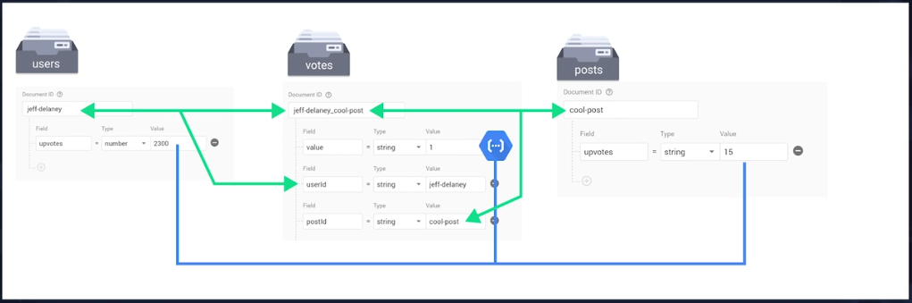
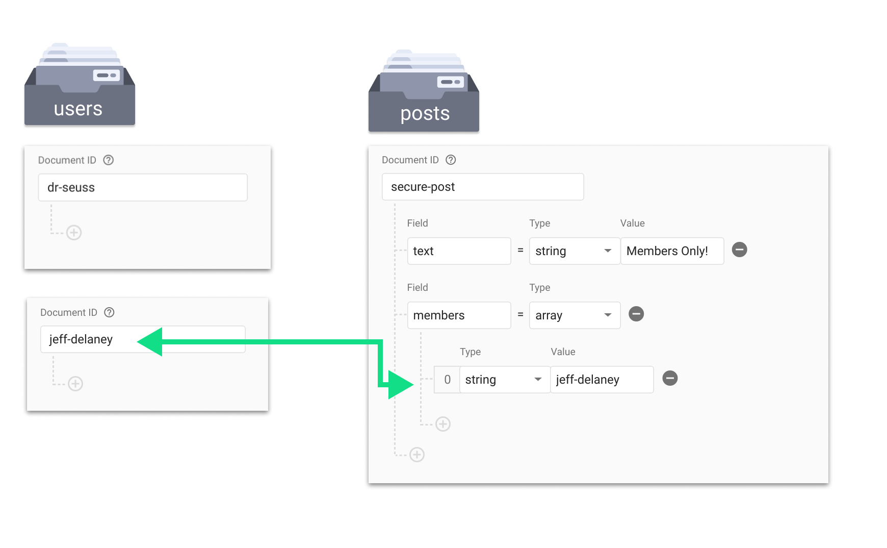
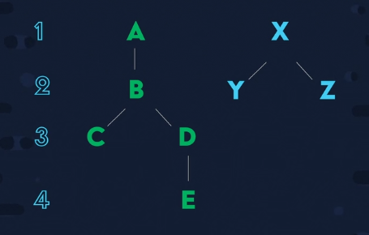

In firebase databases it is imperative to add match rulesets for each
collection that prohibit some sort of cross prototype forgery

treasure-trail
SS: Firebase Security
S: Firebase Model Course
A: Cloud Functions Master Course 

<h2> A: What is Serverless? </h2>

serverless is not serverless, "Serverless functions" and just nodejs clouds that are preconfigured,
waiting to be used.

Http: 

ex: https://myapp.com/api

Background: 

<h2> S: Firebase Model Master Class Notes </h2>
- Techniques for relating data.

1. Embedding
Adding data directly to a document. (Inside a collection)
- Consider this technique because it is the most performant and cost effective.
- Only practical with small datasets.

2. Root Collection
Each tag its own document id, then we reference that tag id within the post document.

/tags

DocID: string = cool

/posts

DocID: posts
tagIds: string[] = [get DocIDs from tags]

3. Subcollections
Scopes datas to individual documents and is only fetched if request specifically.
these collections imply 1 to 1 relationships, since the sub-collection is referenced
from "beneath" the document.

4. Bucketing
creates a new document in a different collection, with all the necessary relational data embedded in it.


<h3>Firestore Read Function</h3>

Note: Jeff says that if your code is clean and concise, 
it is likely your data model reflects this.

```javascript
import {db} from './config';

// Single Doc Read
const ref = db.collection('posts').doc('postId');

// Subcollection Read
const ref = db.collection('posts').doc('postId').collection('tags');

// Bucket Read
const post = db.collection('posts').doc('postId')
const post = db.collection('tags').doc('postId')

// Multi-doc Read

/***
 * Note that firebase databases below the hood, uses a pipelining methodology that collapses
 * all asyncronous requests and allows us to run await/async code concurrently,
 * 
 * */

const post = await db.collection('posts').doc('postId').get();
const tagIds = post.data().tags
const tagReads = tagIds.map(tag => db.collection('tags').doc(tag).get())

const tags = await promise.all(tagReads);

const readIds= async (collection, ids) => {
    const reads = ids.map(id => collection.doc(id).get());
    const res = await promise.all(reads) // Did not know you could feed a promise map to promise.all. Thats OP.
    return res.map(v => v.data())
}
```

// Basic Where

```javascript
// Order by can also be used as a .filter()
// Method chaining is optional.
rangeQuery = db.collection('posts').orderBy('date')
    .limit(20)// chaining
    .startAfter(lastWeek) // pagination
    .endBefore(someDate) // Reverse pagination

const query = db.collection('posts').where('date','==',today)
    .where('name', '==', 'j')

// One drawback is that the does not operator does not exist. The Irony.
// The solution ? make 2 range queries

const above = db.collection('posts').where('name', '>', 'j')
const below = db.collection('posts').where('name', '<', 'j')

// Or is also not supported.

```


// Indexes

```javascript
const query = db.collection('posts')
                    .where('')
                    .where('')

```

// Security

Security needs impact the model.

simple rules

// Tells firebase to ignore any commit to the database from the client

match /account/{id} {
    allow read, write: if false
}


// Only allow read and write permissions if the id equest the request authorization ID.
// This allows us to restrict read and write permissions to the user who created it.

match /users/{id} {
    allow read, write: if id === request.auth.id
}


// Public Data Example
// Allows anybody to read the data, but only allows the user who created the data to write to it.

match /profiles/{id} {
    allow read;
    allow write: if id === request.auth.id
}


<h2> Cardinality: How many items can be in a set </h2>

EX: Authors collection -> one-to-few <br>
An author rarely exceeds a superficial number of books.
For data that has relatively low cap, <b>embedding is the best</b>

if the author data is alot, but still fits within the range of 1 mb, 
we should consider using a bucket.

with a set with HIGH CARDINALITY, we want a collection (one to billions)

<h1> Firebase Relationships </h1>

<h2> One-to-One </h2>

NOTE: 
<br>When referring to the items, say collection.
<br>When referring to the structure, say document.

If data is safe to be exposed to the frontend, we can embed it on the parent document.<br>
If data is NOT safe, it is a must to separate it out into its own document.<br>
We can maintain a relationship by using the same id in both collections.<br>,
(This method is slightly ineffective, requires 2 reads)

```javascript
// Embedded Example
const authorWithAccount = db.collection('authors').doc(userId)

// Shared Document ID
const author = db.collection('authors').doc(userId)
const account = db.collection('account').doc(userId)


// Join related documents with different IDs

const getAccount = async (userId) => {
    const snap = await db.collection('authors').doc(userId).get()

    const user = snapshot.data()
    return db.collection('accounts').docs(user.accountId)
}
```

<h2> One-To-Many </h2>

The first option is embedding an array *of* maps, good for a small number of items, <br>

Do I need to query this data? <br>

yes ? <br>
Make a subcollection (can only query scopes to a particular Id) <br>


Do I need to query across multiple documents? <br>
We then want to model our books as a root collection. <br>
A root collection holds a field that references the one-to-many relationship,
such as a AuthorID field on a book collection<br>
----<br>
According to Jeff, this model is reliable<br>


```javascript
const authorId = 'dr-suess'

// 4. Embedded one-to-many,
const authorWithBooks = db.collection('authors').doc(authorId)

// 5. Sub Collections
const books = db.collection('authors').doc(authorId).collection('books')

// 6. Root Collections
const booksFrom1971 = db.collection('books')
    .where('author', '==', authorId)
    .where('published', '>', 1971)

```

<h3>UPDATE</h3>
After May29th? There was a good update for subcollections that allowed us to query
multiple subcollections across a single document.

This new feature is called the db.collectionGroup() query.

```javascript
db.collectionGroup('books').where('published','==','1974')

```

<h2> Many-To-Many </h2>


Scenario:<br>
Books collection, authors collection, users can write reviews about books but can only write one review per book. <br>

This relationship can be achieved by using a "Middleman" collection<br>
Books and Authors *should* have no knowledge of the reviews collection<br>
Therefore it is the middlemans collections responsibility to handle all the information
about the relation. <br>
This is achieved by maintaining a authorId and bookId field on the review document.<br>

Note: This also creates a CompositeID field which is a concatenation of the two
fields used to maintain the relationships on the middleman collection. <br>
This CompositeID is the key for restricting users to only post one review per book.


```javascript
// 7. Middleman collection
const userReviews = db.collection('reviews').where('author', '==', authorId)
const bookReviews = db.collection('reviews').where('book', '==', bookId)

// single doc read using the CompositeID
const specificReview = db.collection('reviews').doc(`${bookId}_${authorId}`)

// 8. Map (One advantage is that firebase automatically gets the keys for the map)
const booksWithReviews = db.collection('books').doc(bookId)
// Order by implicitly filters out all the documents that do not have this property.
const userReviews = db.collection('books').orderBy('reviews.jeff-delaney')

// The drawback to method 8, is if we're pulling in more data that we actually need,
// Then we're also going to get that when querying just the reviews.

// 9. Array (Not effective for filtering multiple categories at once)
const books = db.collection('books')
    .where('categories', 'array-contains', 'fiction')

```
Another strategy we can use to gain a *better* (with unsensitive data) many-to-many relationship, we can embed the reviews collection onto the books document as a map.
On the books document we have a reviews field, which is a map, each key in the map, is the corresponding userId who wrote the review, this also restricts only one review per person.


<h1> Advanced Techniques </h1>

<h2> Avoiding Duplication </h2>

Should I duplicate Data?

From an SQL Background your instinct might scream <b>*NO*</b>, but in NoSQL creating extra documents in firestore is not a bad thing. This can save you a lot of unnecessary reads from a database.

A technique that utilizes data duplication:<br>
scenario:<br> a user has a lot of comments on a post and each comment requires
the user of the poster to display it. Instead of reading from the user collection
each time we need a username, we can duplicate the username field onto the comments document and we're happy.

<h1> Example Models </h1>
<h2> Votes </h2>

```
usersCollection {
    DocumentId: thomas-shank
    
    upvotes: number     = 2300
}

votesCollection {
    DocumentId: thomas-shank_cool-post

    value: string       = 1
    userId string       = thomas-shank  
    postId string       = cool-post
}

postsCollection {
    DocumentId: cool-post

    upvotes: number     = 15
}
```



<h2> Role Based Authorization </h2>

This type of model will require a rule.<br>
This rule will allow only users assigned to specific roleGroups to
update, and write to the data specified by the [allow update] and [allow write] rules.

Firebase offers an alternative to Rolebased authorization via Custom Claims. custom claims allow us to execute logic directly on the user authentication record.

The model for this is fairly simple, we have a Roles field on a users document that specifies what permissions they have.
It is good for global authorization models.
```
// Top Level Rule for a Authorization Model.
match /databases/{database}/documents {
    match /{document=**} {
        allow read, write: if false;
    }
}

match /posts/{document} {

    function getRoles() {
        return get(/databases/$(database)/documents/users/$(request.auth.uid)).data.roles
    }

    allow read;
    allow update: if getRoles().hasAny(['admin', 'editor']) == true;
    allow write: if getRoles().hasAny(['admin]) == true;
}
```

Jeff says that if your app requires a lot of authorization it is wise to look to Custom Claims.

<h2> Access Control List </h2>
Good when the content itself needs to define who has access to it.

scenario:
<br> posts document has a members field that directly embeds which users are assigned to whatever collection. This allows us to display information to only the members within that field 

rules.json

match /posts{document} {
    allow read;
    allow write: if resource.data.members.hasAny(request.auth.id)
}


```
usersCollection {
    DocumentId: thomas-shank
}

usersCollection {
    DocumentId: pink-guy
}

postsCollection {
    DocumentId: secure-post

    field: text         = "Membership Required :("
    members: array      = [
        0 string:       = thomas-shank
    ]
}
```



<h2> Tree or Hierarcy </h2>




Each letter in the tree represents a document. All documents are in the same collection, as a thread of comments, we would want to query the first thread, then down query/paginate down the tree if the user wants to review the replies attached to that thread, instead of throwing everything at the ui at once.

There is a solution to this by creating a CompositeKey that references the parent document. each document has a string field referencing parents in order.

```javascript
// Make a top level query where the parent === false

const topLevel = db.collection('comments').where('parent','==',false);

const traverseBredth = (level) => db.collection('comments').where('level','==',level)

// Note that the Wav symbol (~) adds all of the concatenated ID's that create the compositeKey field relating all of the documents.
const traverseDepth = (id) => {
    return db.collection('comments')
        .where('parent','>=', id)
        .where('parent','<=', `${id}~`)
}
```

<h2> Social Follower Feed </h2>

scenario: Create a social feed where users can follow eachother, and see the posts from the users that they follow. 

Failed Attempts: client-side queries <br>
select * from posts <br>
where user in (...userIds); <br>
We need to query every single person that the user is following :( <br>

Failed Attempts: Mass Duplication<br>

```javascript
export const getFeed = async() => {

    const followedUsers = await db.collection('followers')
        .where('users', 'array-contains', 'userId')
        .orderBy('lastPost', 'desc')
        .limit(10)
        .get();


    const data = followedUsers.docs.map(doc => doc.data());

    const posts = data.reduce((acc, cur) => acc.concat(cur.recentPost), [])

    const sortedPosts = posts.sort((a,b) => b.publish - a.publish)
}

```


<h1> SS: Firebase Security Masterclass </h1>

CourseLink: https://fireship.io/courses/firebase-security

<h2> What Will I Learn? </h2>

- Firestore security fundamentals
- How to audit a firebase app for security vulnerabilities.
- Common use-cases including role-based auth, access-control lists, and more.
- Advanced techniques and code optimization tips
- Unit testing and debugging reports

Firebase Database Security Rules protects information and keeps malicious
users from using the database references on the client. The infastructure can be applied to all the firebase database types. 

write security logic within the rules that check tokens and roles to deny or allow access to data. These rules are written in COMMON EXPRESSION LANGUAGE (CEL)


This simple table expression completely locks down our data. According to Jeff.
```sql
service cloud.firestore {
    match /databases/{database}/documents {
        match/users/{userId} {
        
            allow <what> <under what condition?>
            allow read: if request.auth != null

            alow write: if request.auth.uid == userId
        }
    }
}

```


